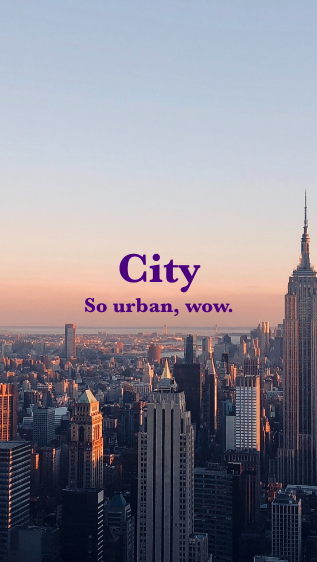

# react-components

A mono repo containing some React components

## Components

### HeroHeader

[Component README](./packages/HeroHeader/README.md)

Inspired by the title cards from Netflix's _We are the Champions_, this component provides full screen, mobile friendly hero images.

| Description                                                          | Image                                                                                                        |
| :------------------------------------------------------------------- | :----------------------------------------------------------------------------------------------------------- |
| Horizontal screenshot of the header using the default `color`        |  |
| Vertical screenshot of the header using `indigo` as the `color` prop |      |

## Assets

This repo contains a number of assets. Licenses and attribution are shown below.

- `/assets/images/city.png` - [Bing HAO](https://unsplash.com/@bingh) via [Unsplash](https://unsplash.com/photos/_wqj9tC0WSE)
- `/assets/images/forest.png` - [Sergei Akulich](https://unsplash.com/@sakulich) via [Unsplash](https://unsplash.com/photos/-heLWtuAN3c)
